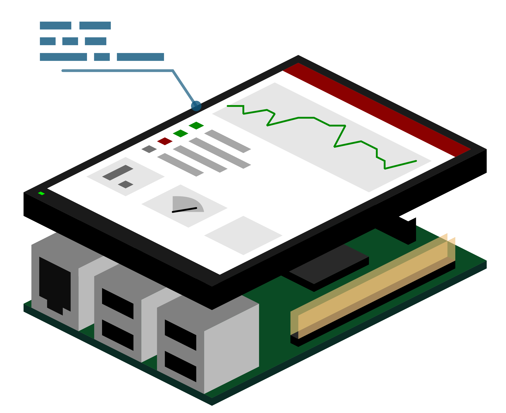

raspi-dashboard
===============

Boot a Raspberry Pi directly into a minimalistic, frameless browser.

This project does not include any webserver or storage to save data to be shown. The data to be shown must be accessible over the network, provided by a different device or service, for example:

 - [Status Board at Panic](https://www.panic.com/blog/the-panic-status-board/)
 - [Geckoboard](https://www.geckoboard.com/)
 - [Dashing](http://shopify.github.io/dashing/)
 - [Keen IO](https://keen.github.io/dashboards/)
 - [Mozaik](http://mozaik.rocks/)
 - [Grafana](https://grafana.com/)
 - [Freeboard](https://freeboard.io/)
 - ...

Installation
------------

Create the package and install it using

    makepkg -si

and reboot. Enable the dashboard using

    systemctl enable --now dashboard@tty7.service

for peace of mind you can reboot the system every day by enabling

    systemctl enable --now scheduled-reboot.timer

Customization
-------------

Edit the dashboard service

    systemctl edit dashboard@tty7.service

and adjust the URL in

    ExecStart=/usr/bin/cage /usr/bin/luakit "https://www.google.com"

to your liking.

Readonly filesystem
-------------------

To protect your SD card against wear and tear, see [`arch-overlayroot`](https://github.com/nils-werner/arch-overlayroot) for a simple overlay based readonly file system solution.
